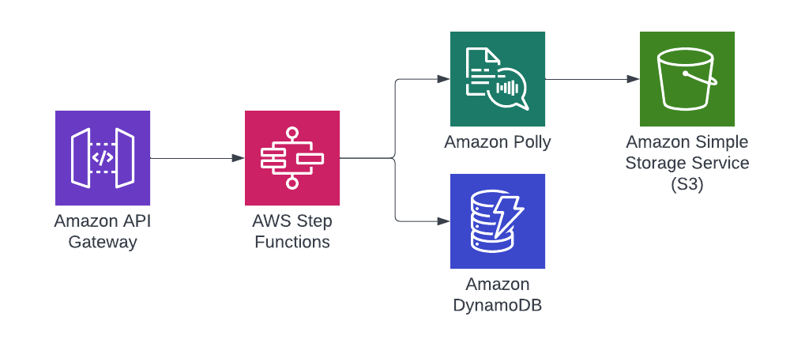

# AWS - An Environment Per Branch with CDK

This repo contains two [CDK](https://aws.amazon.com/cdk/) applications that demonstrate a way to configure an application to create a branch specific environment that can be used for development and testing and then deleted following a merge. There are scenarios this is not possible due to cost, or account limitations, but works best for serverless applications that have no cost unless utilised.

## [Application 1 - Standard CDK App](1-standard-cdk-app)
This application demonstrates a simple CDK application with a few stacks and resources - this is the application that will be modified to be "branch aware" and can be used as the basis of a compare.

This initially started from the example provided by [Serverless Land](https://serverlessland.com/) and can be found on [GitHub](https://github.com/aws-samples/serverless-patterns/tree/main/stepfunction-polly-s3-cdk). ##, but it was extended to be fronted by API Gateway and also store a row into [DynamoDB](https://aws.amazon.com/dynamodb/) to help demonstrate stateful resources.

### System Overview



### Stacks
The application is broken down into two stacks, which is a Stateless stack and a Stateful stack. This breakdown is a useful pattern to isolate the resources which carry more risk, versus those without. An example of this could be that if the application renames some IDs and the stack needs deleting and recreating, if this happened in a stack with stateful and stateless resources (S3 bucket and a lambda for example) then it could mean losing all the data.

### Once deployed then it can be executed by hitting the API with a POST and passing in JSON similar to:

```json
{
    "phrases": [
        "Run when you have to, fight when you must, rest when you can.",
        "Always jumping around, always so hasty and you have the whole world to do it in."
    ]
}
```

Within a few seconds there should be two MP3s in the S3 bucket, and two rows in the DynamoDB table.

FYI, there is **no** API security setup for this example.

## [Application 2 - Branch Aware CDK App](2-branch-aware-cdk-app)
This is a copy of the first application, but with some modifications to allow it to dynamically create a branch specific application.

### Changes
The first set of changes are in the bin/generate-speech-app.ts file. 
1. The branch name needs to be read in, with it being TypeScript then it could be read dynamically by running git processes or via NPM packages - but this is a clean and safe way to do this. A [context variable](https://docs.aws.amazon.com/cdk/v2/guide/get_context_var.html) is used for this: `this.node.tryGetContext('branch')`.
2. The stack names need to be dynamically named with this branch name in them, this suddenly means a new stack is created for each branch: `${branch}-GenSpeechStatefulStack`
3. Due to the fact that stateful resources (S3, DynamoDB, etc.) will be set to [Retain](https://docs.aws.amazon.com/AWSCloudFormation/latest/UserGuide/aws-attribute-deletionpolicy.html) by default so that data is not lost. For the main branch then this is most likely the expected behaviour, but for short-lived branches then this will become a problem. Therefore setting them to Destroy on delete can be done by passing a boolean value to the stack based on if the branch is main or not: `destroyOnRemove: branch.toLowerCase() !== TRUNK_BRANCH_NAME`
4. A lot of the resources will be named automatically by CDK using a prefix from the stack name, and then a hash. This means the majority of the resources will have the branch name in the resource name for easy navigation/searching. The resources that don't do this will be an issue (Step Functions, API Gateway, etc) - and could even clash completely, such as API Gateway which uses just the ID as the name. To ensure all resources are uniquely named, and have the branch name in them, then for these resources the branch name should be passed into the stack and a property set as appropriate: `stateMachineName: `PhraseSynthesiser-${props.branch}`
5. Final change is optional, but a recommendation, and that is to set a tag to all resources with the branch name. This can then be used for filtering, reporting, and so on. This can be achieved by tagging the stacks, and cloudformation will then tag all the resources `cdk.Tags.of(statefulStack).add('Branch', branch)`

## Gotchas
* Branch names need to be short and safe characters only, being dynamic means this is a risk. This can be policed in CDK by validating the context variable and failing before it goes too far. That and CI prior to running CDK. This includes Casing differences between branches - might be allowed in Git but some resources are lowercase only.
* Having the branch in the stack at the start will auto rename a lot of resources - but it is trimmed after a certain amount of characters so not 100% reliable, but helps massively. If you want to firm the name then set property on all resources.
* Beware of resource limits and how CDK creates resources behind the scenes for you. This can mean there are a lot of [Security Groups](https://docs.aws.amazon.com/vpc/latest/userguide/VPC_SecurityGroups.html) for example, and so if there are a lot of branches it can hit limits. This process is only safe to use where branches are short lived, but it's worth being aware of all the resources created and check account limits.
* Cost! This might be an obvious one, but if there are resources which are not scale-to-zero then cost can add up. A full review of the resources should be completed prior to using this model.

## Deployment Instructions
If you have CDK installed globally then you can call `cdk` direct, if not you can use `npx cdk` - also see the [Getting started guide](https://docs.aws.amazon.com/cdk/v2/guide/getting_started.html).

1. Run `npm install` in the application directory.
2. Deploy with `cdk deploy --all --require-approval never --context branch=BRANCH-999`.
3. Destroy with `cdk destroy --all --force --context branch=BRANCH-999`.

An example of a CI setup can be seen in the [.github](.github/workflows) folder.
